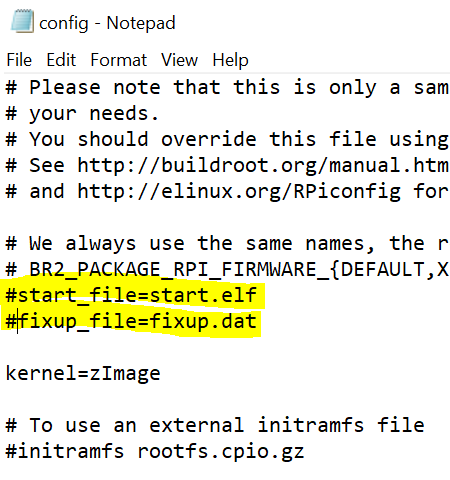
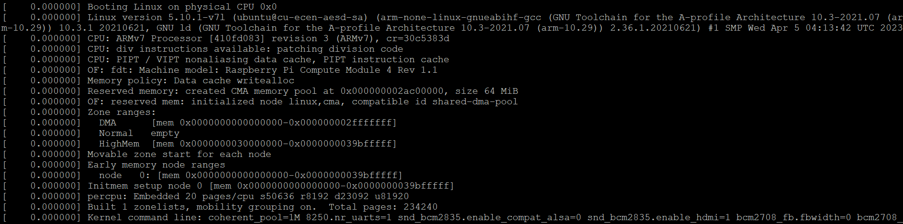

# Buildroot setup for Raspberry Pi 4

Config for building kernel and root filesystem for Raspberry Pi 4

## Build steps ##
1. Checkout 2022.x branch in buildroot
2. Modify buildroot menuconfig toolchain settings as per requirements
3. Run build.sh
4. Flashing images are generated in the buildroot/output/images folder.

## Flashing RPi ##
RPi4 compute module has an onboard eMMC which requires a specific set of steps to be followed for flashing.
[RPi4 Flashing](https://www.jeffgeerling.com/blog/2020/how-flash-raspberry-pi-os-compute-module-4-emmc-usbboot)
This link describes the steps.

## Troubleshooting ##

The buildroot files for the boot partition of the image contains a config.txt which may not be correctly configured.
Ensure that below lines are commented out.
```
start_file=start.elf
fixup_file=fixup.dat
```
And to enable UART add line
```
enable_uart=1
```


Below logs were observed on the UART.

